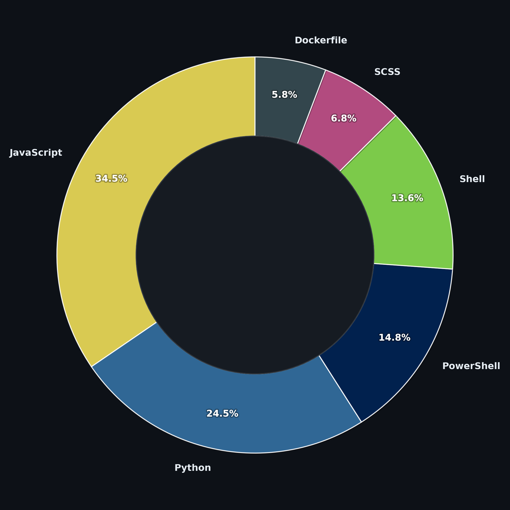

# 👨‍💻 Fernando Pasqualini

**`Architect & Software Engineering Student`**

Systems Analysis and Development student at UMESP and CS50 (Harvard/edX) graduate transitioning from Architecture to Software Engineering.

Leveraging a strong background in spatial logic, modular design, and systems thinking, I build clean, efficient full-stack applications. Passionate about software engineering fundamentals, database modeling (SQL), containerization (Docker), and clean code in Python and C.

---

### 🤖 Languages and Technologies

 
 

---

### 📊 Profile Metrics

  

 
 

---

<h3 align="left">Connect with me:</h3>

